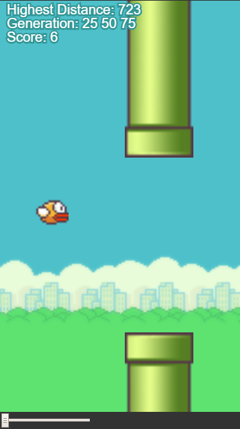

# Flappy Bird (Machine Learn)
This is a core of a Flappy Bird based game using Machine Learn to train the software to play.

There are 3 options here:
* **Play**
  Play just for fun.
* **Load Trained Brain**
  See how the software plays with 3 Neural Networks previously trained.
* **Machine Learn**
  See how the software train the Neural Network generation by generation.

You can try it in this link https://editor.p5js.org/RaphaelBruno/sketches/N0_l4Jh3S

## Libraries
* TensorFlow.js
* P5.js
